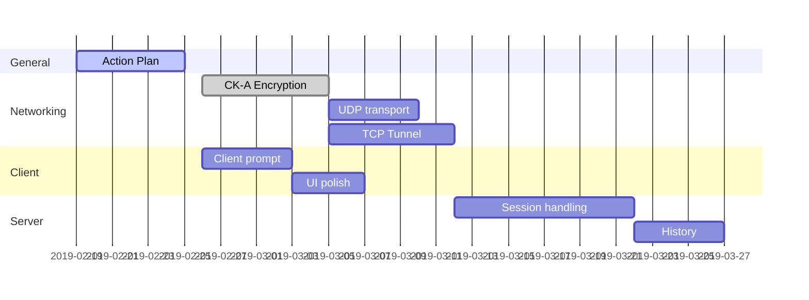
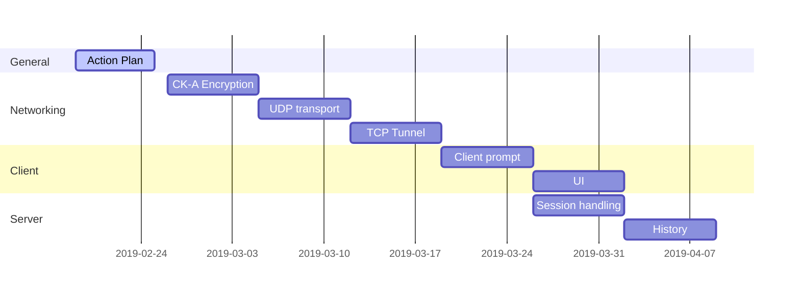

# Action Plan

Goal: Server-based chat program

Start Date: 2019-02-01

Team Members:

| Name            | NetID     | Initials |
| --------------- | --------- | -------- |
| Seth Giovanetti | stg160130 | SG       |
| Oscar Contreras | oxc160030 | OC       |
| Tam Nguyen      | tdn170530 | TN       |
| Brennan Stuewe  | brs140230 | BS       |

## Table

(Derived from gantt charts, see below)

| No   | Action                        | Responsible | Deadline   | Resources Needed | Result | C    | Issues |
| ---- | ----------------------------- | ----------- | ---------- | ---------------- | ------ | ---- | ------ |
| 1    | Action Plan                   | SG          | 2019-02-26 |                  |        |      |        |
| 2    | UDP transport                 | SG          |            |                  |        |      |        |
| 3    | CK-A encryption               | SG          |            |                  |        |      |        |
| 4    | TCP tunneling                 |             |            |                  |        |      |        |
| 5    | Client prompt and messaging   | SG          |            |                  |        |      |        |
| 6    | Server session handling       |             |            |                  |        |      |        |
| 7    | History storage and retrieval |             |            |                  |        |      |        |
| 8    | Polished client UI            | SG          |            |                  |        |      |        |
|      |                               |             |            |                  |        |      |        |
|      |                               |             |            |                  |        |      |        |
|      |                               |             |            |                  |        |      |        |

## Notes

Tam Nguyen has opted not to contribute to the group project and build a standalone network program for his own education.

## Deadlines

2019-02-26: Action plan due

2019-03-12: Status report due

2019-04-23: Status report due

2019-04-29: Final submission due

### Components

- Action plan
- UDP transport and UDP protocol codes
- CK-A Encryption (and challenge/response)
- TCP tunneling
- Client prompt and messaging (interactivity)
- Server session handling (messaging, overhead, activity timer, etc)
- History storage and retrieval
- Clean up client UI

Optimized/Real scenerio:

(Last updated: 2019-02-22)

Final product ready 2019-04-14

Worst case scenerio: 7d per component, minimal parallelism:

Final product ready 2019-04-14

