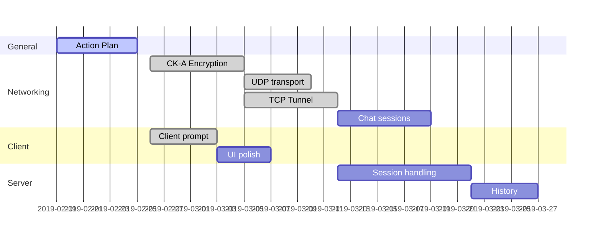

# Action Plan

Goal: Server-based chat program

Start Date: 2019-02-01

Team Members:

| Name            | NetID     | Initials |
| --------------- | --------- | -------- |
| Seth Giovanetti | stg160130 | SG       |
| Oscar Contreras | oxc160030 | OC       |
| Tam Nguyen      | tdn170530 | TN       |
| Brennan Stuewe  | brs140230 | BS       |

## Table

(Derived from gantt charts, see below)

| No   | Action                             | Responsible            | Deadline   | Resources Needed | Dependencies | Result                                                  | Completed | Issues                                                       |
| ---- | ---------------------------------- | ---------------------- | ---------- | ---------------- | ------------ | ------------------------------------------------------- | --------- | ------------------------------------------------------------ |
| 1    | Action Plan                        | SG, OC                 | 2019-02-26 | GitHub           | None         | Get idea of how tasks will be divided                   |           | Most of team is less experienced in Python - members will need to use resources to become familiar. |
| 2    | UDP Transport and Protocol         | SG (, OC?)             |            | IDE              | None         | Messages for login / initiation of connections done     |           |                                                              |
| 3    | Authentication and CK-A Encryption | SG (, OC?)             |            | IDE              | 2            | Clients can be authenticated; messages can be encrypted |           |                                                              |
| 4    | TCP Tunneling                      | (worked on by SG?), OC |            | IDE              | 2,3          | Ready to implement client-client messaging              |           |                                                              |
| 5    | Chat sessions                      |                        |            |                  |              |                                                         |           |                                                              |
| 6    | Client Prompt and Messaging        | SG                     |            | IDE              | 2,3,4        | Chat between clients can be performed                   |           |                                                              |
| 7    | Server Session Handling            |                        |            | IDE              | 2,3,4,5      | Functional chat in place                                |           |                                                              |
| 8    | History Storage and Retrieval      | OC                     |            | IDE              | 2,3,4,5,6    | Chat history retrievable by clients                     |           |                                                              |
| 9    | Polished Client UI                 | SG                     |            | IDE              | 2,3,4,5,6,7  | Implementation of chat program done                     |           |                                                              |
## Notes

Tam Nguyen has opted not to contribute to the group project and build a standalone network program for his own education.

## Deadlines

2019-02-26: Action plan due

2019-03-12: Status report due

2019-04-23: Status report due

2019-04-29: Final submission due

### Components

- Action plan
- UDP transport and UDP protocol codes
- CK-A Encryption (and challenge/response)
- TCP tunneling
- Client prompt and messaging (interactivity)
- Server session handling (messaging, overhead, activity timer, etc)
- History storage and retrieval
- Clean up client UI

Optimized/Real scenerio:

(Last updated: 2019-02-22)

Final product ready 2019-04-14

Worst case scenerio: 7d per component, minimal parallelism:

Final product ready 2019-04-14

