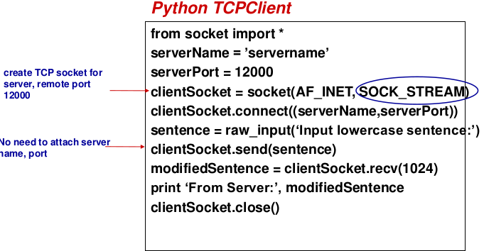
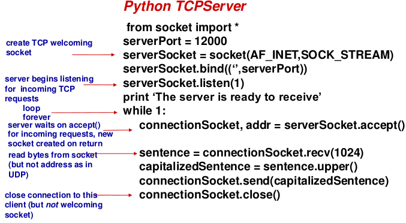
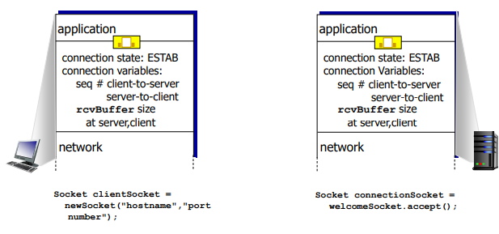
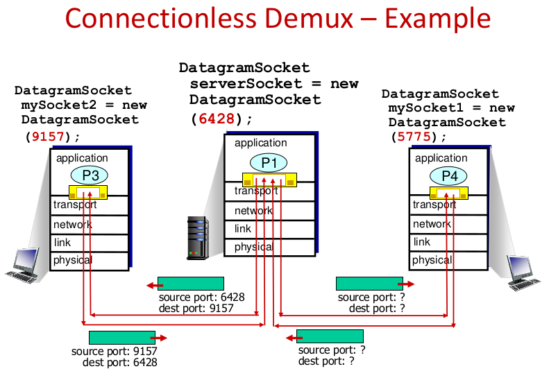
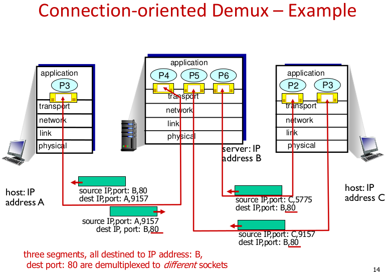
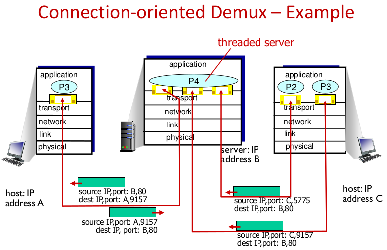

# Lecture Material

### Socket programming with UDP (6)

No "connection" between client and server

- no handshaking before sending data
- sender explicitly attaches IP destination and port # to each packet
- receiver extracts sender IP address and port # from received packet

### Socket Programming with TCP (6)

Client must contact server

- Server process must first be running
- Server must have created socket that welcomes client contact

Client contacts server by

- Creating TCP socket, specifying IP address, port number of server
- Client then establishes connection to server TCP
- When contacted by client, **server TCP creates new socket** for server process to communicate with that particular client
  - Allows server to communicate with multiple client
  - Source port numbers used to distinguish clients

Connection negotiation

Server runs tcpAccept on an existing welcome socket. This creates a new socket on the same port, bound to the client. 

Client runs tcpConnect and connects 

## Multiplexing (7)

### UDP Demultiplexing

Connectionless

When sending datagram, sender must specify destination IP and port

When host receives UDP segment:

- Host checks destination port # in segment
- Directs UDP segment to socket with that port #
- IP datagrams with same dest, port #, but different source IP and/or source port will be directed to same dest socket.

## TCP Demultiplexing

Connection-oriented

TCP socket is identified by a 4-tuple: source IP, source port, dest IP, and dest port

Receiver uses all four values to direct segment to the appropriate socket

Server may host many simultaneous TCP sockets

Web servers have different sockets for each connecting client

