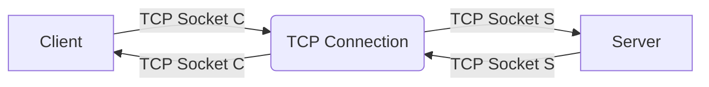
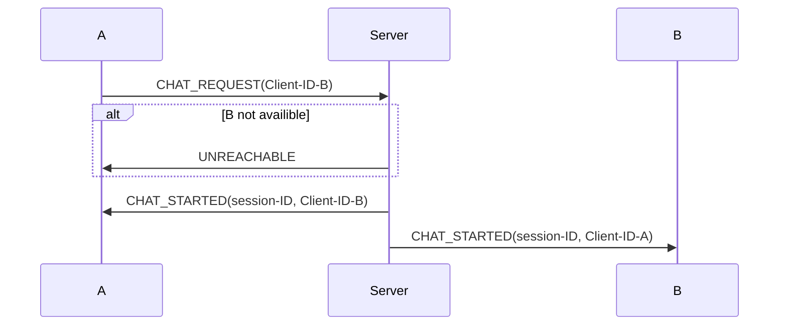
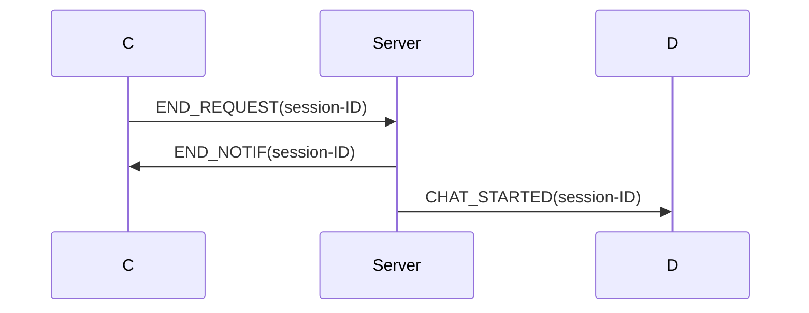

# System Overview
End User -> Client -> Server

Client
- Unique Client-ID
- Secret key

Server
- Collection of Clients

# Network

## UDP

## TCP

Server has a Listening Socket (TCP/UDP???)

Server has a set of TCP sockets, all on the same TCP port.

Server and client negotiate a TCP Connection

Server creates a socketserver and serves forever on a thread

Client creates a TCP socket and CONNECTS to the server address

Client A initiates chat session to client B

# Chat termination

# Security

Only clients are authenticated, based on challenge-response.

Server and client run concurrent A8 algorithm

No integrity protection

# History

