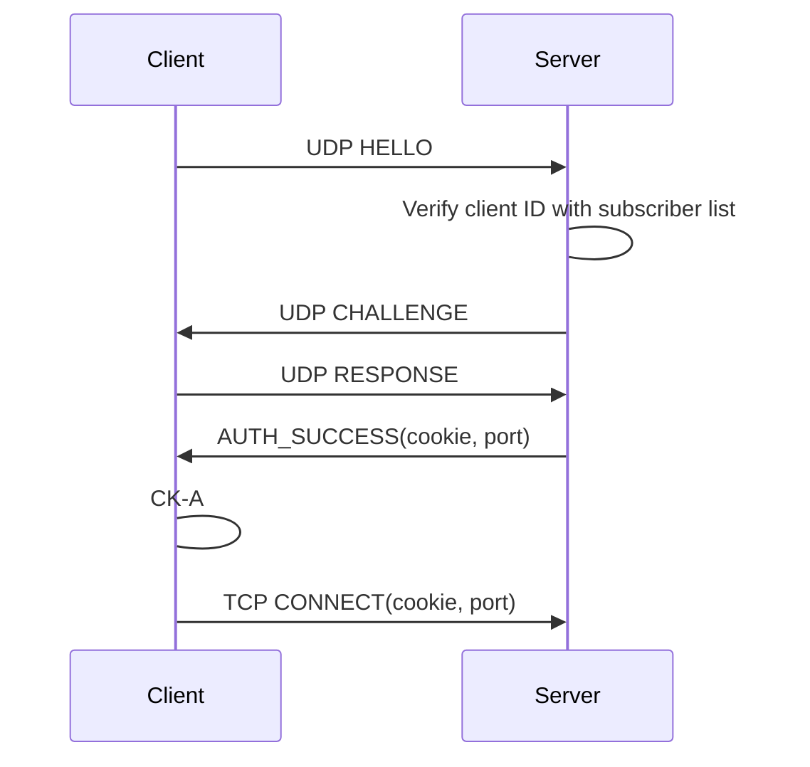
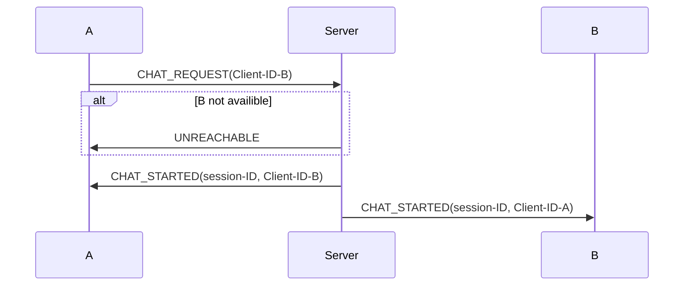
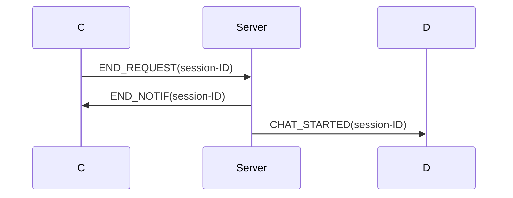

# System Overview

End User -&gt; Client -&gt; Server

Client

<ul>
<li>Unique Client-ID</li>
<li>Secret key (provided by server)</li>
</ul>

Server

<ul>
<li>Collection&lt;Client&gt;</li>
</ul>
# Connection to the Server

# Client A initiates chat session to client B

# Chat termination

# Security

Only clients are authenticated, based on challenge-response.

Server and client run concurrent A8 algorithm

No integrity protection

# History

# Protocol

- HELLO(Client-ID)
- CHALLENGE(rand)
- RESPONSE(Client_ID, Res)
- AUTH_SUCCESS(cookie, port_number)
- AUTH_FAIL()
- CONNECT(cookie)
- CONNECTED()
- CHAT_REQUEST(Client-ID)
- CHAT_STARTED(Session-ID, Client-ID)
- UNREACHABLE(Client-ID)
- END_REQUEST(Session-ID)
- END_NOTIF(Session-ID)
- CHAT(Session-ID, message)
- HISTORY_REQ(Client-ID)
- HISTORY_RESP(Client-ID, message)