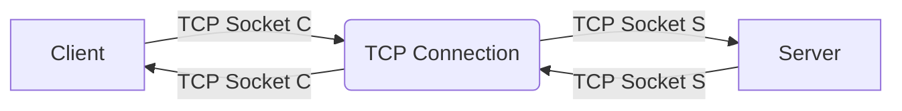
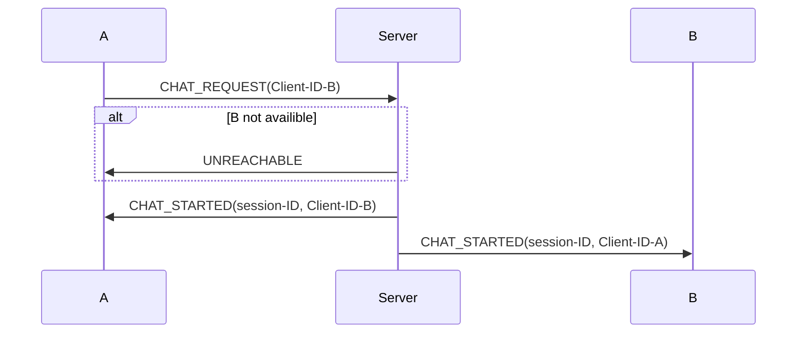
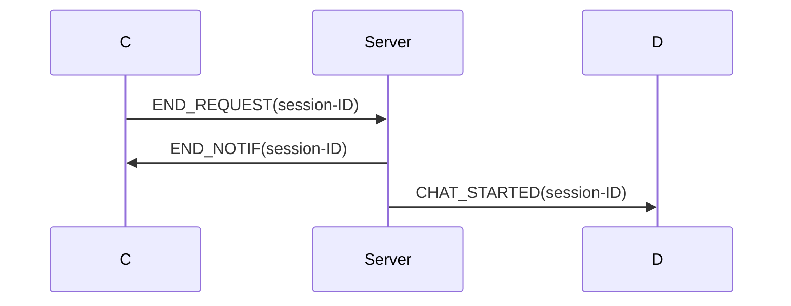

# System Overview
End User -> Client -> Server

Client
- Unique Client-ID
- Secret key

Server
- Collection of Clients

# Network

## UDP



## TCP

Server has a Listening Socket (TCP/UDP???)

Server has a set of TCP sockets, all on the same TCP port.

Server and client negotiate a TCP Connection

​```mermaid
graph LR;
Client
Server
tcpc(TCP Connection)
Client --> |TCP Socket C| tcpc
Server --> |TCP Socket S| tcpc
tcpc --> |TCP Socket C| Client
tcpc --> |TCP Socket S| Server

```


# Connection to the Server

​```mermaid
sequenceDiagram
participant Client
participant Server
Client->>Server: UDP HELLO
Server->Server: Verify client ID with subscriber list
Server->>Client: UDP CHALLENGE
Client->>Server: UDP RESPONSE
Server->>Client: AUTH_SUCCESS(cookie, port)
Client->Client: CK-A
Client->>Server: TCP CONNECT(cookie, port)
```

# Client A initiates chat session to client B



# Chat termination



# Security

Only clients are authenticated, based on challenge-response.

Server and client run concurrent A8 algorithm

No integrity protection

# History

