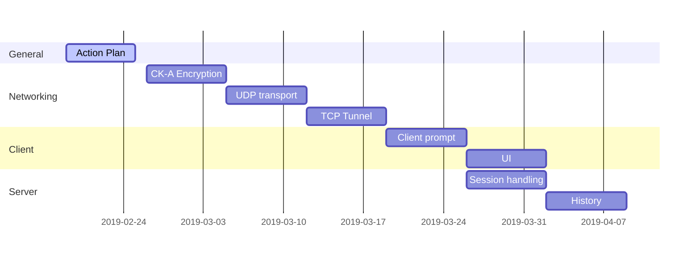
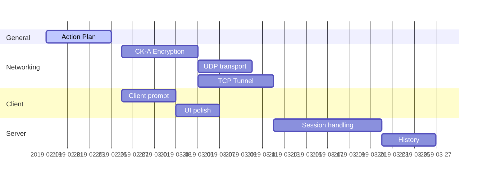

# Action Plan

2019-02-26: Action plan due

2019-03-12: Status report due

2019-04-23: Status report due

2019-04-29: Final submission due

### Components

- Action plan
- UDP transport and UDP protocol codes
- CK-A Encryption (and challenge/response)
- TCP tunneling
- Client prompt and messaging (interactivity)
- Server session handling (messaging, overhead, activity timer, etc)
- History storage and retrieval
- Clean up client UI

Worst case scenerio: 7d per component, minimal parallelism:

Final product ready 2019-04-14

Optimized/Real scenerio:

Final product ready 2019-04-14